# Red Cedar split Keyboard Build Guide

This keyboard was designed to look a bit like a red cedar tree - it has a green outer shell with a red cedar bark tree stem 🌲(copper PCB) showing through :). 

The PS2 buttons were just for fun - but they do allow you to comfortably press Control and Alt at the same time with one thumb 👍. The Nintendo Switch joysticks run the mouse and vertical + horizontal scroll. Have a look at the build guide below for how I integrated these components. The idea to integrate game controller components comes from the [Dactyl TypeSafe](https://github.com/tewtham/dactyl-typesafe). 

When I built my first keyboard I learned so much from build guides, so I'd also like to share this with others. I included lots of pictures and the 3D model files so you can build it yourself or modify the design to your liking.

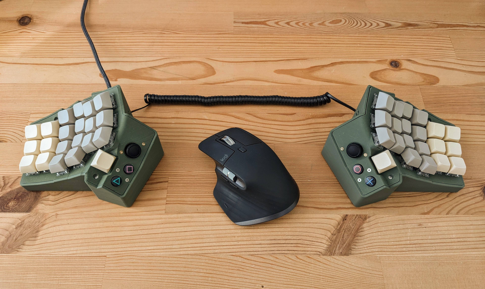

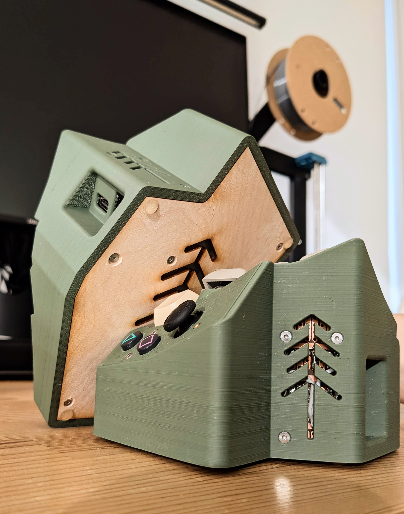

## Bill of Materials
At the time you're reading this, some items might be unavailable from the listed sellers; go ahead and find a seller that has it in stock! Where it says 'example link', I have not purchased that item from that seller, but it looks like it's what I have.

It should be noted that these are the materials for the final build. While building, I created several failed prototypes that used extra screw heat inserts, for example.

| item                                          | link                                                                            | comments                             |
| --------------------------------------------- | ------------------------------------------------------------------------------- | ------------------------------------ |
| olive green PLA printer filament              | https://www.amazon.ca/dp/B0945S8T8Z?psc=1&ref=ppx_yo2ov_dt_b_product_details    | pick your favorite print color 👌|
| 1/8” x 2” x 4 foot steel flat iron            | https://www.homedepot.ca/product/paulin-1-8-x-2-x-48-inch-steel-flat/1000126734 | Only needed 24”, not 48”. for adding weight to each side, so it doesn’t jostle or tip upon key presses|
| 3mm thick birch plywood                       | https://www.amazon.ca/Plywood-Perfect-Cutting-Burning-Technology/dp/B08TQGD18Y  | Example link. For keyboard base.|
| 6x rubber nubs                                | https://www.amazon.ca/Adhesive-Furniture-Bumpers-Cabinets-AUSTOR/dp/B074C2XKXH  | for keyboard feet so it doesn’t slide on desk (3x per side so it can’t wobble if uneven)|
| Old PS2 dual shock controller                 |                                                                                 | I got mine on a used marketplace for $5. It doesn’t have to turn on, you just need the buttons.|
| Motor winding wire                            | https://www.aliexpress.com/item/1005005439484725.html                           | Example link. For soldering onto PS2 button PCB |
| heat shrink                                   | https://www.aliexpress.com/item/1005006991396293.html                           | Example link. |
| 2x RP2040 pro-micro                           | https://www.aliexpress.com/item/1005005881019149.html                           | I used the pro micro, NOT the pico mini (different size) |
| diodes                                        | https://www.aliexpress.com/item/4000142272546.html                              | Example link.|
| 22 AWG solid core wire                        | https://www.aliexpress.com/item/1005004712828392.html                           | Example link. For wiring the keys and diodes together |
| 2x 30pc XDA Key caps, grey and milk color     | https://www.aliexpress.com/item/1005006227054571.html                           | Make sure the caps you choose will fit the key switches you choose below|
| 50x Cherry MX Brown Switches                  | https://www.aliexpress.com/item/1005006255961111.html                           | Get whatever switches you like, but my 3D model fits the switches listed here|
| 1x PCB breadboard                             | https://www.aliexpress.com/item/32944023746.html                                | Example link. Only need 1 (cut it in half to use for each keyboard side).|
| RJ9 jacks, 2pcs                               | https://www.aliexpress.com/item/1005004927524975.html                           | You want the 4P4 option, since you need 4 pins (ground, V, and 2 serial pins) |
| RJ9 phone cord (spiral), 2m                   | https://www.aliexpress.com/item/1005004600591782.html                           |  |
| 2.54mm round female and male headers          | https://www.aliexpress.com/item/33052907672.html                                | For allowing pro-micro to be removed without unsoldering. The female will solder to the PCB and the male will solder to the pro micro.|
| M2 x 6mm machine screws                       | https://www.aliexpress.com/item/1005006908821896.html                           | Example link. For fastening things like the PCB, base, and top to the walls.|
| M2 x 8mm machine screws                       | https://www.aliexpress.com/item/1005006908821896.html                           | Example link. For fastening things like the PCB, base, and top to the walls.|
| M2 x 18mm machine screws                      | https://www.aliexpress.com/item/1005006908821896.html                           | Example link. Useful for holding the base of the PS2 buttons to the keyboard top as well as fastening the steel weights to the keyboard base.|
| M2 nuts                                       | https://www.aliexpress.com/item/1005007968910468.html                           | Example link. Can also use lock nuts|
| 2mm heat inserts                              | https://www.aliexpress.com/item/1005003582355741.html                           | Example link.|
| 4x male/female pair of (4P JST XH connector)  | https://www.aliexpress.com/item/1005006227337604.html                           | Example link. For connecting the PS2 buttons and the 4 rows|
| 2x male/female pair of (5P JST XH connector)  | https://www.aliexpress.com/item/1005006227337604.html                           | Example link. For connecting the joysticks|
| 2x male/female pair of (6P JST XH connector)  | https://www.aliexpress.com/item/1005006227337604.html                           | Example link. For connecting the 6 columns. You’ll see in the build photos that I actually used 2x 4P connectors and cut the 4th wire off, since I didn’t have 6P connectors|
| 2x 5 pin ribbon cable breakouts for joysticks | https://www.aliexpress.com/item/1005006156076806.html                           | Note that the 5-pin version is needed to keep the ribbon in the right spot. It’s hard to find. If it’s not available from this seller, it may be from another seller.|
| 2x Nintendo switch Joysticks                  | https://www.aliexpress.com/item/1005006757983388.html                           | Example link. The hall effect joysticks should theoretically be better than the cheaper resistive option, but I haven’t tested them. I just got the cheapest Nintendo switch joysticks |
|                                               |                                                                                 ||
| **tools needed**                              |                                                                                 | More tools are probably needed, but these are the basics|
|                                               |                                                                                 ||
| 3D printer or printing service                | https://www.amazon.ca/dp/B0BTCMXGBT?ref=ppx_yo2ov_dt_b_product_details&th=1     | Example link. I use Sovol sv06 3D printer|
| laser cutter or laser cutting service         |                                                                                 | For cutting out base. Can also 3D print instead|
| soldering iron and solder                     | https://www.hakko.com/english/products/hakko_fx888dx.html                       | Example link. Used for soldering, as well as melting heat inserts into printed parts|
| filter or fan                                 |                                                                                 | so you don’t breathe solder fumes|
| Multi-meter                                   |                                                                                 | for checking PCB connections. I use the “UNI-T UT61E”|
| wire stripping and cutting tool               |                                                                                 ||
| pliers                                        |                                                                                 ||
| precision screwdriver                         | https://www.ifixit.com/en-ca/products/pro-tech-toolkit                          | example link. Make sure it has small enough bits for the M2 machine screws (mine used 1.3mm hex)|
| metal saw                                     | https://www.amazon.ca/Craftsman-Hand-12-Inch-Hacksaw-CMHT20138/dp/B07R92S9YZ    | example link. For cutting the flat iron bar for added weight|
|                                               |                                                                                 ||

## Software
Follow [this link](https://github.com/timwenger/qmk_firmware/tree/master/keyboards/redcedar/readme.md
) for the associated QMK firmware for this keyboard.

## 3D Modeling

### Software
I used [OnShape](https://www.onshape.com/en/) to do all the modeling for all my 3D printed parts. 

OnShape is free to use for personal use, with the requirement that your models must be public. My keyboard file link is [here](https://cad.onshape.com/documents/470f461acb30c7e3d60602d1/w/c9d18d0d1559074f1a9db678/e/220c611e56cff08aa4369190), and you're more than welcome to fork from it and modify the design!

**Tip**: Take your time learning 3D Modeling. OnShape is the most extensive, easy to use and FREE 3D modeling software I know of. It's a great tool, but also a complex tool. So if you're new to OnShape and would like to modify my design, I recommend watching tutorials first.

 When looking at my OnShape 3D Model, you will see the following tabs:

| Tab Name        | Comments                                                                                                                                                                                                                                                                             |
| --------------- | ------------------------------------------------------------------------------------------------------------------------------------------------------------------------------------------------------------------------------------------------------------------------------------ |
| base kb assy    | Assembly of all the common keyboard parts, before they're imported into the **right kb assy** and **left kb assy**                                                                                                                                                                   |
| left kb assy    | Mirror of **base kb assy**, with un-mirrored joystick mount (since the joystick only comes in one orientation) and mount for its ribbon connector, which faces the back wall of the keyboard.                                                                                        |
| right kb assy   | This is the **base kb assy** with mount for the joystick ribbon connector, which faces the side wall of the keyboard.                                                                                                                                                                |
| lattice         | This is a folder that builds up from a single socket, then to 3-key and 4-key rows of sockets, then a full right-hand side main set of keys (the **main lattice**)                                                                                                                   |
| joystick socket | The joystick mount that will hold [this joystick](https://www.aliexpress.com/item/1005006757983388.html)                                                                                                                                                                             |
| buttons         | This is a folder that builds off the joystick socket to ultimately create the **button thumb cluster**. The buttons come from a PS2 controller. It's designed to be clamped together with 2 screws which lightly hold the silicone pad between the PS2 circuit board and the button. |
| dpad            | This is a folder that builds a **dpad thumb cluster** which holds a PS2 dpad. It all worked quite well, but I opted for using the button thumb cluster instead because the dpad buttons were too hard to press.                                                                      |
| cedar stencil   | Used for cutting out the tree shape from the final designs                                                                                                                                                                                                                           |

Once you open each file, you can right click in the left pane, on one one of its parts and **Export...** to download it as an .stl file for 3D printing. For convenience, I've already included these files in this repo though in the `/3d printable files` directory.

### Process
I initially tried to modify existing .stl files, but I had quite a bit of trouble manipulating them in conjunction with the native 3D models in OnShape; so I bit the bullet and just re- modeled everything. I used the [Dactyl Keyboard  generator](https://ryanis.cool/dactyl/#manuform) for inspiration for making a press-fit key switch socket.

I was initially inspired by the tenting and curvature of the Dactyl and the addition of the game controller buttons on the [Dactyl TypeSafe](https://github.com/tewtham/dactyl-typesafe), so I started by printing the TypeSafe .stl files to see how it felt. For the main set of keys, I removed the extra pinky keys that I wouldn't use and adjusted the height and offset of each finger's column. This all took a few print iterations until I was happy with how it felt.

After I was happy with the main set of keys, I got down to work on the thumb cluster. I initially designed a dpad with the intention to use it as Control, Alt, Shift, and Windows keys, but the keys were too hard to press quickly, so I back tracked and incorporated the PS2 buttons instead. This was a great deal of work to model something that could hold the small piece of PCB, the silicone pad on top of it (that has a carbon print which connects the circuit) and allow the button to smoothly slide above it. I printed this thumb cluster several times until I liked how it felt.

Then I integrated the thumb cluster and the main set of keys into one piece and built an outer keyboard wall around it to hold it up. I designed the wall to be a separate piece so that I could more easily solder the keys into the sockets.

The final modeling needed was to create mounts for the main processor and holes for the USB ports. I waited to do this until I had physically built the electrical portion so that I could better estimate what would fit.

You can see the steps I took to model it by using the "Roll back bar". When you drag this bar back through the history of changes, you can see the changes made, and even make edits at that time, then roll the bar forward in time again. Very cool!

## 3D Printing
I'm new to 3D printing, and I found that it's much more of an art that I expected. It's very easy for a print to fail - it can warp, detach from the print bed while printing, the nozzle can hit a warped support and knock it out, etc. There are many 3D printing tutorials out there, so I'll spare you my journey here - but if you're also new to the sport, know that it may not print as perfect as you hope on the first trial.

The top piece with all the key switch sockets was particularly difficult to print without using many print supports that would make the outer surface rough and unpleasant. In the end, this print angle ended up working great!

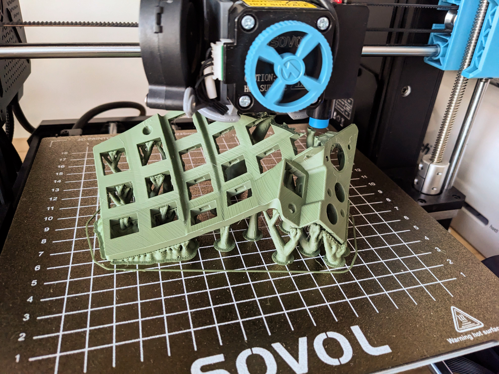

I designed the models to be fastened together with M2 machine screws and [heat inserts](https://www.aliexpress.com/item/1005003582355741.html). These worked great when I used the tip of my soldering iron to melt the insert into the printed plastic.

## laser cutting
I used 3mm (1/8") birch plywood to make the keyboard base, and then used a laser cutter I had access to for cutting it out. I could just as well have printed the base like the other parts, but I laser cut it because the laser cutter was readily available and the wooden base lent itself well to the "red cedar" tree theme. I used my 3D modeled base in OnShape and exported a drawing file to use in the laser cutter software.

## Integrating the PS2 buttons
Integrating the PS2 controller buttons was not easy for me! The plastic buttons push against a silicone pad that has graphite on the bottom of it, which pushes against the main PS2 controller to complete the circuit. It actually supports varying push pressure, as the resistance changes from about 5 kOhm when pressed lightly down to 2 kOhm when pressed hard. I ended up wiring these into the QMK matrix just like other switches though, and it works pretty well (apparently a 5 kOhm resistance is low enough to be registered as an active digital input on the RP2040 processor I'm using). 

 This didn't come without its challenges though
 - now that the PCB was cut, I needed to get the signals out from underneath the silicone pad. I used very thin motor winding wire so that it wouldn't push the pad out of shape and reduce the effectiveness of the button.
 - I actually bought 2 used PS2 controllers from the same guy, and found that they were not built the same inside. One had a plastic sheet printed with carbon traces that the silicone pressed against, while the other had the traces printed on a traditional PCB (no plastic sheet). Because I couldn't solder wires to the plastic sheet, I opted to cut the PCB up instead. I mostly used a Dremel for this.

Pics below:
1. PS2 controller with unusable plastic traces. I had to use the other PS2 controller I had which used a traditional PCB instead.
2. PS2 PCB cutout with motor winding wires soldered on
3. Assembled button cluster

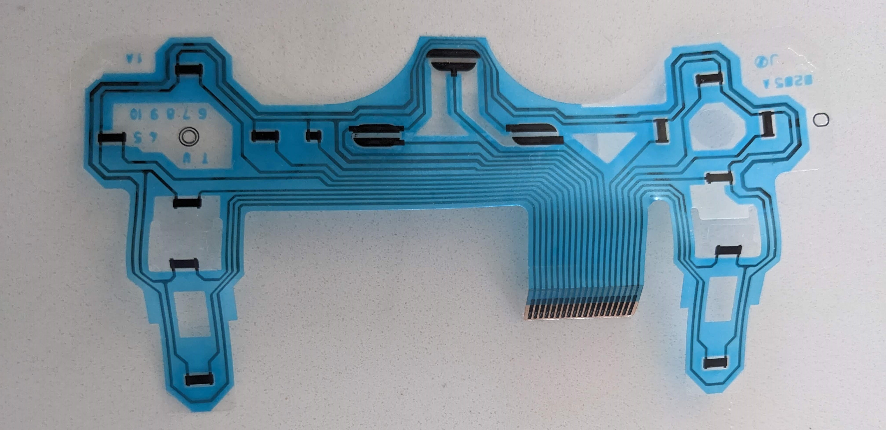
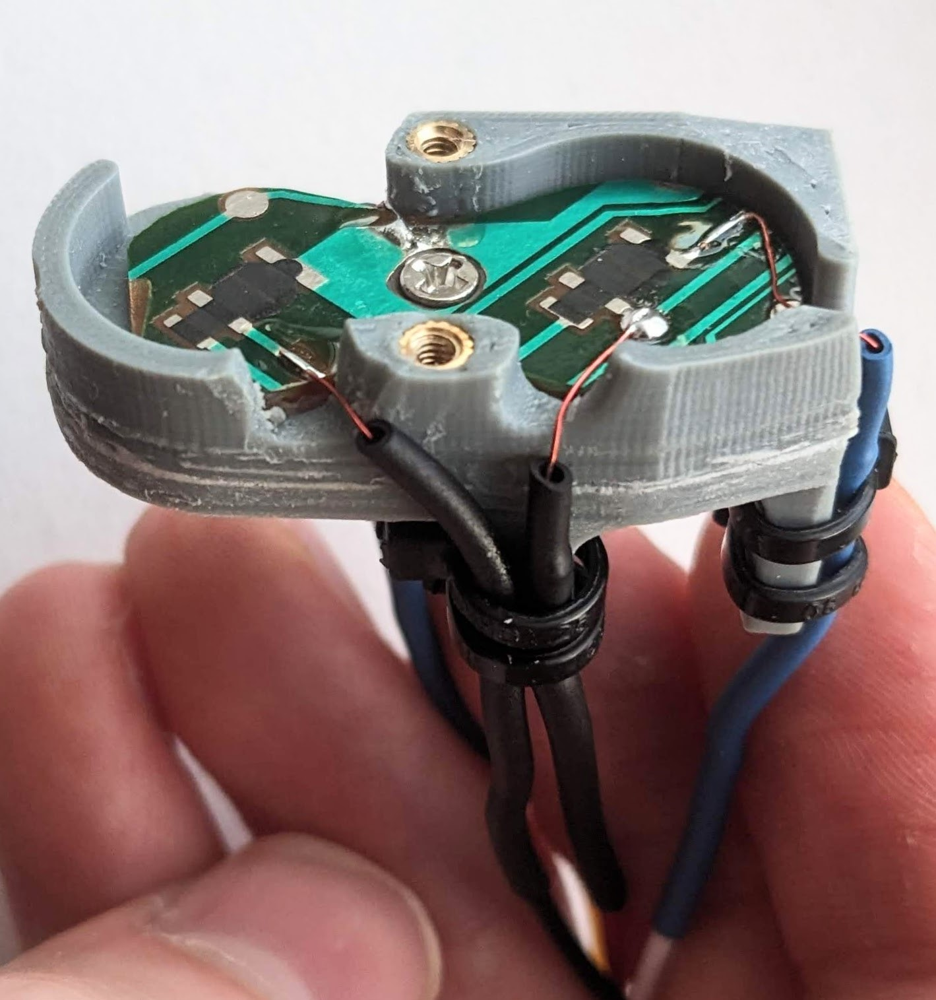
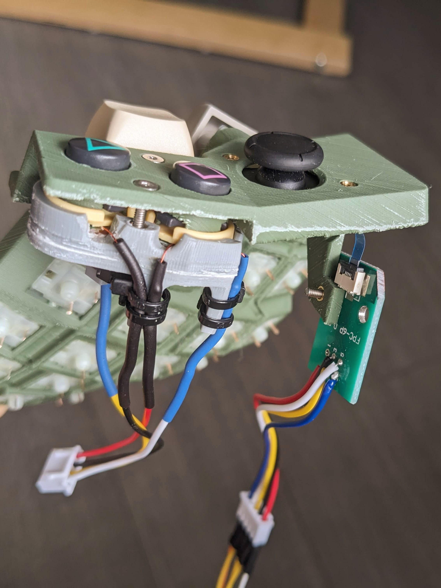

## Integrating the Nintendo Joysticks

The ribbon connector on the Nintendo Joysticks cannot be soldered because it has carbon traces on a plastic ribbon. The hardest part about integrating this then, was to find a ribbon connector break-out board that I could easily work with. The [5-pin break-out board that I found](https://www.aliexpress.com/item/1005006156076806.html) expands to a larger board that I can easily solder wires to (as in the picture above with the assembled button cluster). I found many 6-pin options, but I felt this wouldn't work consistently, because clamping a 5-pin ribbon in a 6-pin mount could allow the connector to connect incorrectly. If this 5-pin connector is out of stock, hopefully you can find another seller with something similar!

The joystick V+ is connected to the processor's 3.3 volt rail. With the joystick pushed all the way to its edges, it measures lowest at about 0.64 volts and highest at about 2.41 volts. I wired up the center click button, but didn't use it because it takes so much force to press.

## Wiring up the keys
The key switches are connected in a matrix with separating diodes so that only 1 I/O pin is needed for each row and column on the processor. I followed [this guide](https://medium.com/swlh/complete-idiot-guide-for-building-a-dactyl-manuform-keyboard-53454845b065) when soldering the keys.

I used [pre-made wires with plugs](https://www.aliexpress.com/item/1005006227337604.html) to connect to the switches so that the top piece with the switches could be easily separated from the host breadboard PCB. I used different connectors for the rows, columns, buttons, and joystick to keep everything separate. I used 2x 4-pin connectors for the columns, only because I didn't have a 6-pin connector. Here's a pic of the main matrix with connectors attached.

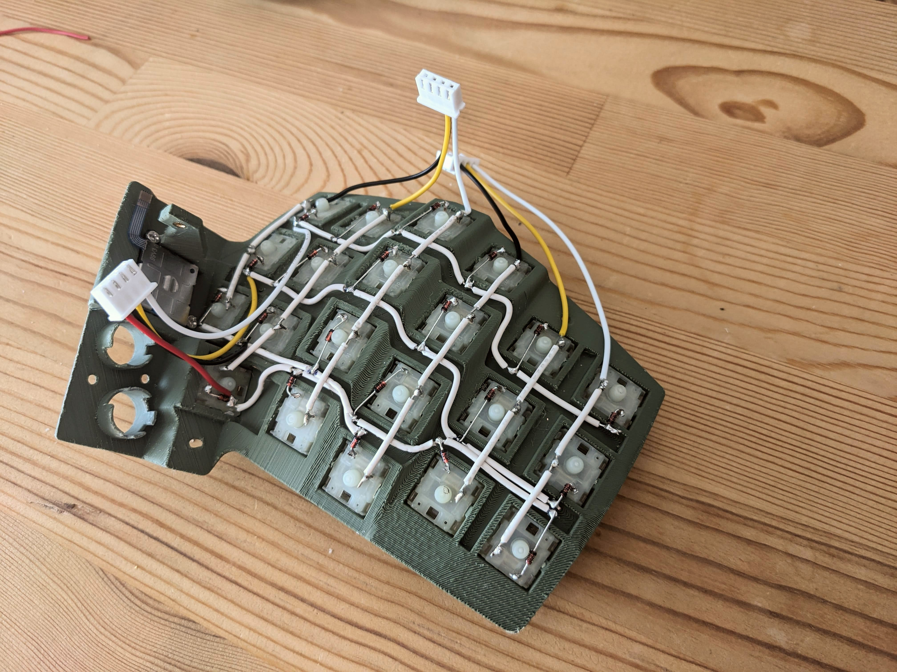

Aside from the main key switches, I also connected the buttons as though they were part of the main matrix, on row 4 and columns 4,5,6, and 7. The Joysticks connected to analog input pins on the processor (pins 26 and 27). Although not top quality, here is the wiring schematic I used:

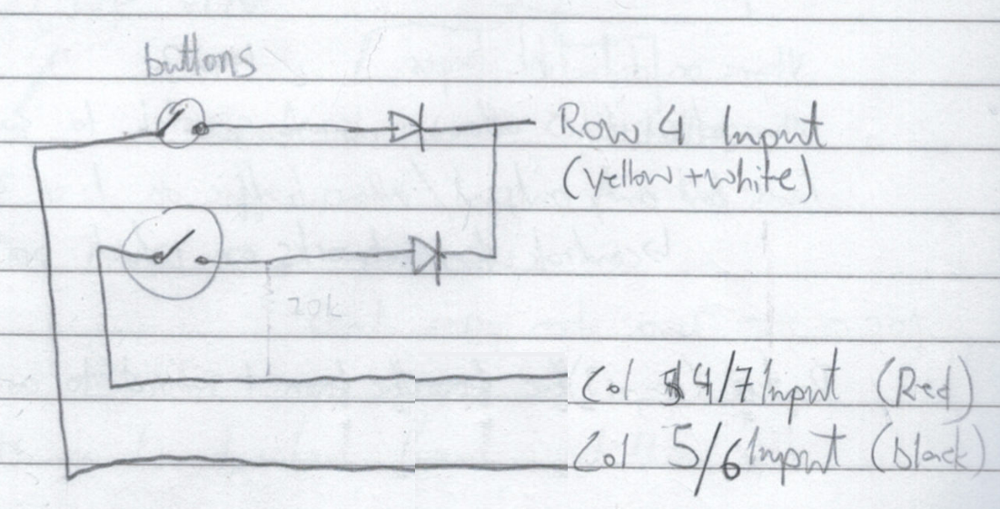
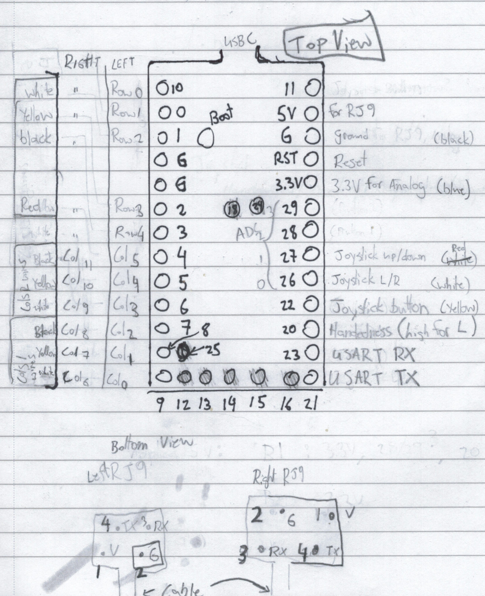
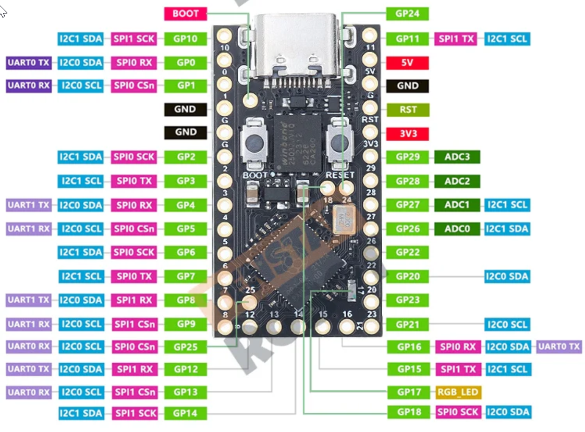

## The host breadboard PCB
I mounted the [RP2040 processor](https://www.aliexpress.com/item/1005005881019149.html) on [header pins](https://www.aliexpress.com/item/33052907672.html) so that it can be easily replaced. With the extra space underneath the headers, I fit all the wires that would go to the connectors. 

A single [breadboard PCB](https://www.aliexpress.com/item/32944023746.html) can be used for both keyboard halves. Once cut in half, I shaped it using sandpaper to properly fit it on the keyboard side wall. I also drilled mounting holes and a larger hole to fit the four [RJ9 connector](https://www.aliexpress.com/item/1005004927524975.html) pins.

Pics below:
1. The RP2040 host breadboard PCB soldering, before it was shaped and drilled
2. The mounted and shaped breadboard PCB

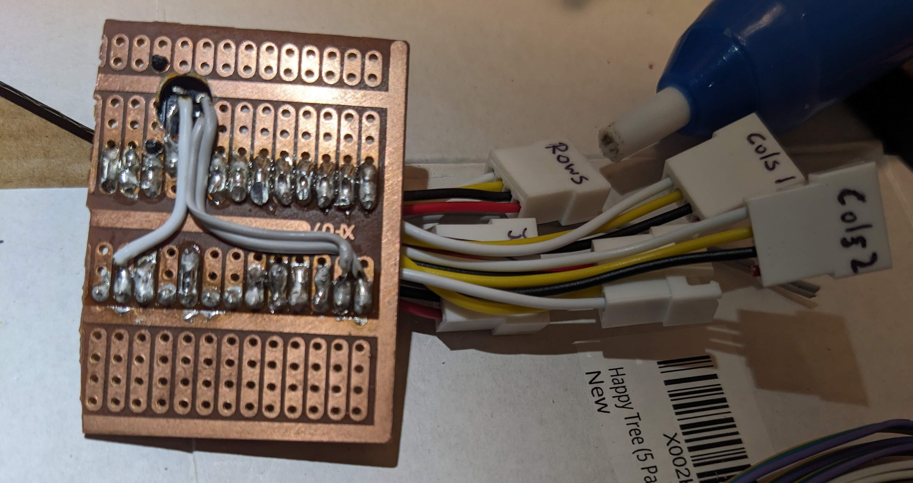
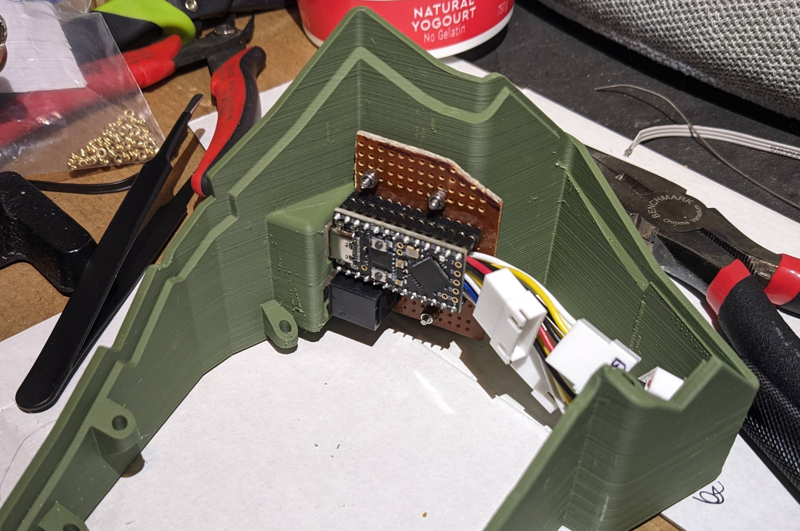

The resulting electrical system looked like this, before the base plate was added on:

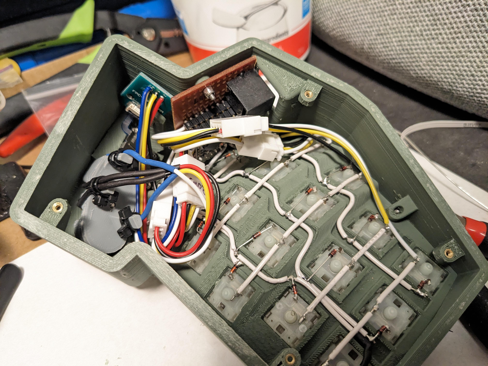

## Adding weight

Once everything was electrically sound, the last bit of work was to add weight to the keyboard. Because the key switches are quite high up, striking the keys can jostle the keyboard. An ideal solution would be to cut out the base plate from steel or brass with a CNC machine (instead of wood as I did), if that's available to you. In my case though, the only metal cutting tool I had was a hand saw, so I set to work layering up different lengths of 1/8" x 2" steel flat bar, filling the void inside the keyboard. I drilled these and screwed them to the base, and then covered them with electrical tape so they don't touch the key switch prongs.

I found that the resulting weight (which used about 11" of flat bar per side) was heavy enough that the keyboard was stable with only 3 [rubber nubs](https://www.amazon.ca/Adhesive-Furniture-Bumpers-Cabinets-AUSTOR/dp/B074C2XKXH) - meaning that it will never wobble, despite an uneven desk.

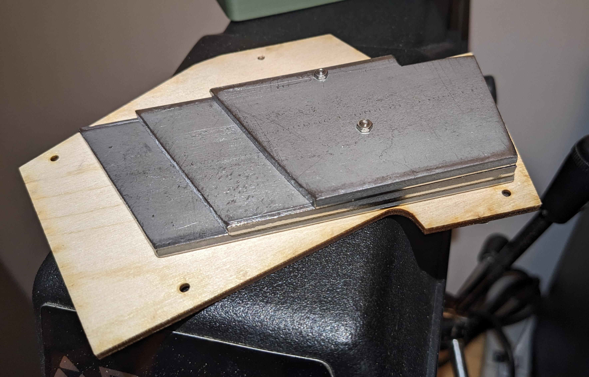

## Closing
I hope this guide makes your keyboard building adventure more straight forward, and I look forward to seeing your build on the reddit community!

If I were to make another version of the keyboard, I would want to make the key switches swappable without having to unsolder them, in case I wanted to try lighter spring weights or something else